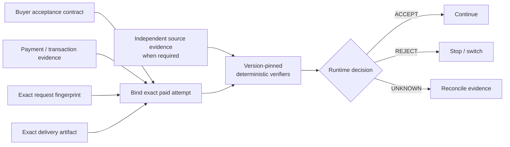

# High-level Runtime Acceptance architecture

MOV owns one narrow boundary:

> **after machine payment / delivery evidence exists, but before downstream software trusts the purchased result.**



## Core invariant

```text
PRECOMMITTED BUYER ACCEPTANCE CONTRACT
+ EXACT PAYMENT / TRANSACTION EVIDENCE
+ EXACT REQUEST
+ EXACT DELIVERY ARTIFACT
+ INDEPENDENT SOURCE EVIDENCE WHEN REQUIRED
+ VERSION-PINNED DETERMINISTIC VERIFIERS
= ACCEPT | REJECT | UNKNOWN
```

## Separation of concerns

MOV deliberately keeps three facts separate:

1. **Payment state** — did the economic event settle, fail, or remain uncertain?
2. **Delivery state** — did a delivery arrive, fail, or remain uncertain?
3. **Acceptance state** — did the exact delivered result satisfy the buyer's contract?

A green payment or transport layer cannot override a failed acceptance predicate.

## Buyer ownership

The buyer defines acceptance before or at the paid attempt. Typical predicates may cover:

- entity / subject identity;
- required fields;
- schema;
- allowed sources;
- freshness;
- value constraints;
- evidence requirements;
- verifier identities and versions.

Natural-language convenience can help author a contract, but deterministic evidence-bound rules remain outcome authority for the current wedge.

## Evidence rule

When an acceptance predicate depends on external truth, a merchant's own assertion is not sufficient evidence. The required source evidence must be acquired independently or through a buyer-controlled path and bound to the exact attempt.

## Why `UNKNOWN` exists

MOV fails closed. Required evidence that is missing, contradictory, unavailable, corrupt, or non-final results in `UNKNOWN` rather than optimistic acceptance.

## Deliberate abstraction level

This document describes the public product contract. It does not publish MOV's private kernel implementation, payment/signing execution, infrastructure topology, private verifier packs, commercial workflows, or internal architecture blueprint.
